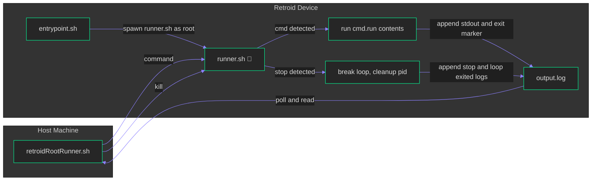

# retroidRootRunner

A persistent root command bridge for Retroid devices. Enabling root commands over adb on
stock/unrooted devices.

TL;DR: Run root commands an unrooted Retroid device!

> [!WARNING]
> This project enables root-level command execution (from trusted devices only).
> Read and understand the files in this repo before running them.  
> Use at your own risk.

## Prerequisites

- Retroid device with **USB (or wireless) debugging enabled**
- `adb` installed on your computer, device connected and authorized
- A Retroid device with **"Run script as root"** developer feature available
  - Supported on most if not all Retroid devices (testing done with Retroid Pocket 5)

## Initial Setup

From the root of this repository:

```bash
adb shell "mkdir -p /sdcard/retroidRootRunner" # Create a folder for application files
adb push device_files/*.sh /sdcard/retroidRootRunner/ # Push the scripts to the device
adb shell "chmod 755 /sdcard/retroidRootRunner/*.sh" # Set execute permissions
```

## Usage

### 1. Spawn the runner via the entrypoint

- Navigate to **Settings** ➡️ **Handheld Settings** ➡️ **Advanced** ➡️ **Run script as Root**
- Browse to `/sdcard/retroidRootRunner/` and select `entrypoint.sh`

### 2. Send commands

Helper script `retroidRootRunner.sh` sends commands, then polls `output.log` for a
completion marker, and ultimately returns both to your shell (with error handling).

For Example:

```bash
./retroidRootRunner.sh 'id; getenforce'
```

Output:

```text
=== Mon Aug 17 21:58:15 EDT 2026 ===
id; getenforce
--- output ---
uid=0(root) gid=0(root) groups=0(root) context=u:r:pservice:s0
Permissive
=== exit 0 ===
```

Tune polling if needed: `RRUN_POLL_INTERVAL` (default 1s), `RRUN_TIMEOUT`
(default 60s). See `./retroidRootRunner.sh --help` for details.

### 3. Kill / shut down

```bash
./retroidRootRunner.sh kill
```

Output:

```text
Stopping runner...
Stopped and cleaned up.
```

Touches `stop`, waits for the runner to log its exit, then removes the
leftover `cmd`/`stop`/`runner.pid` control files.

## Application Flowchart



## Notes / Use Cases

- A hung command in `cmd.run` blocks the loop until it returns; wrap risky
  commands with `timeout`
- `output.log` isn't rotated, clear it if left running long
- Anything that can write to the `cmd` file can run commands as root while the process is running, be careful
